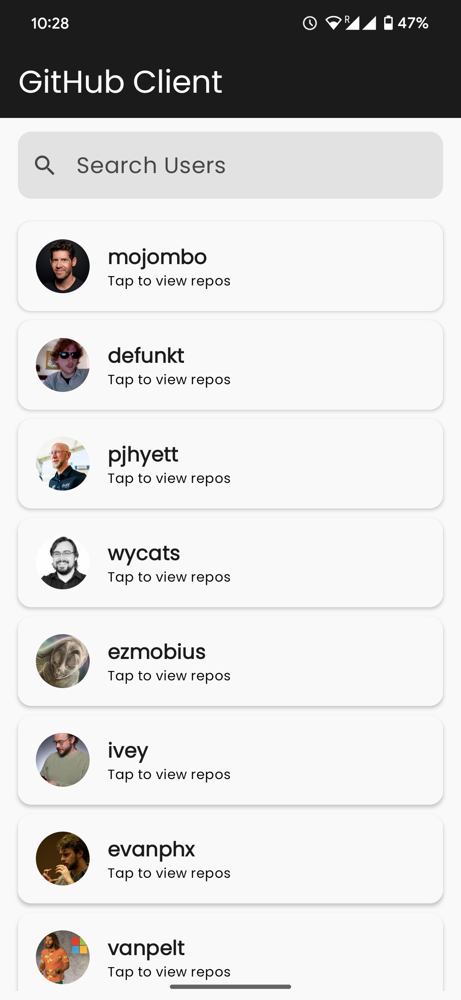
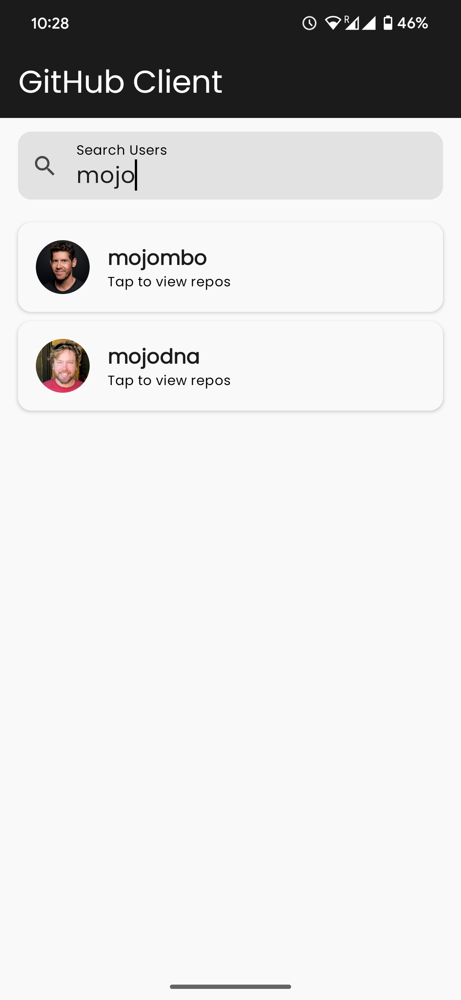
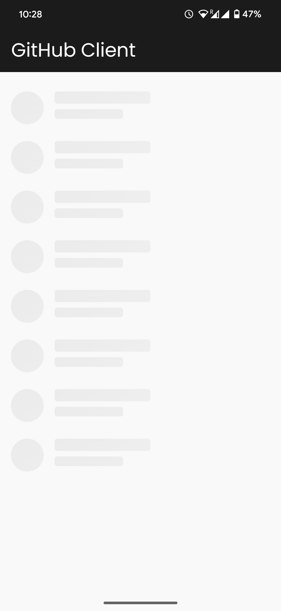
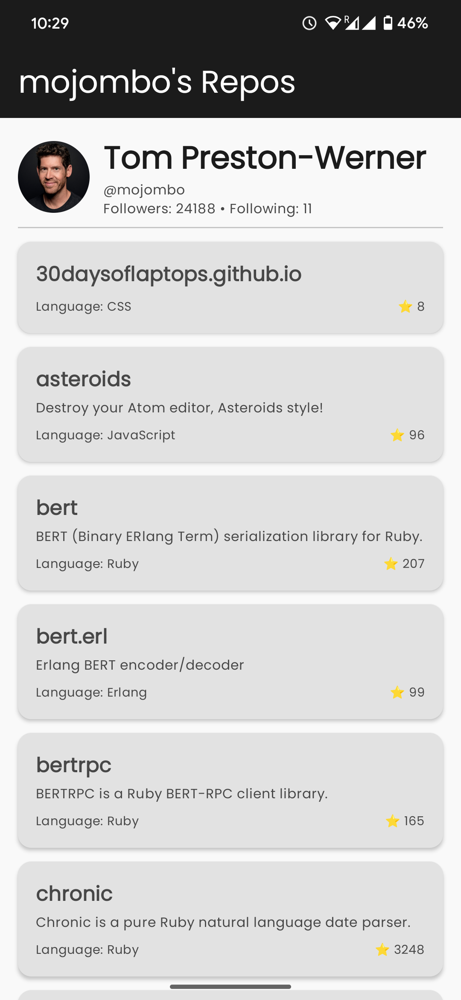
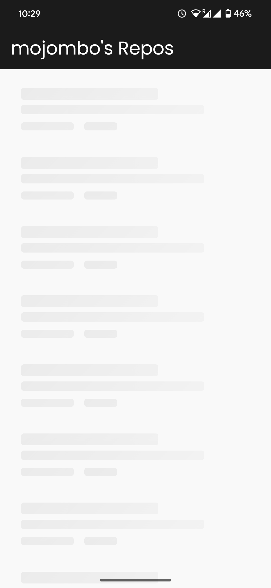
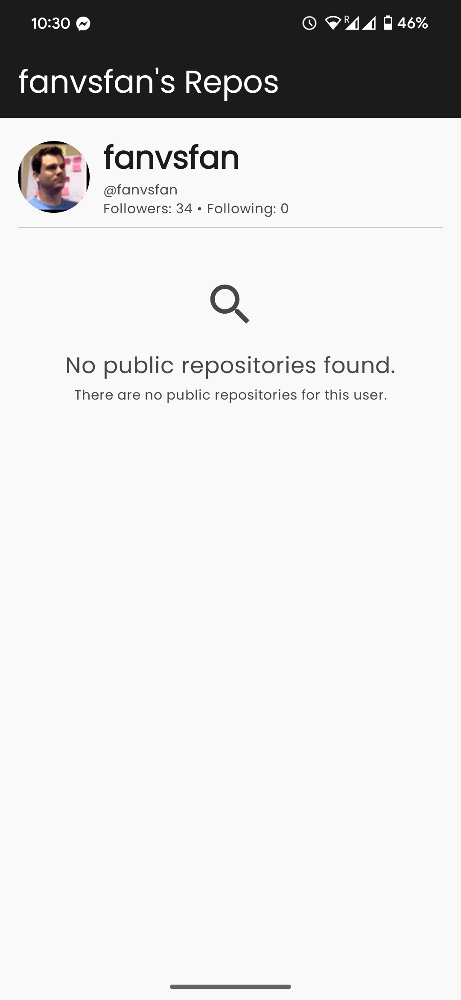
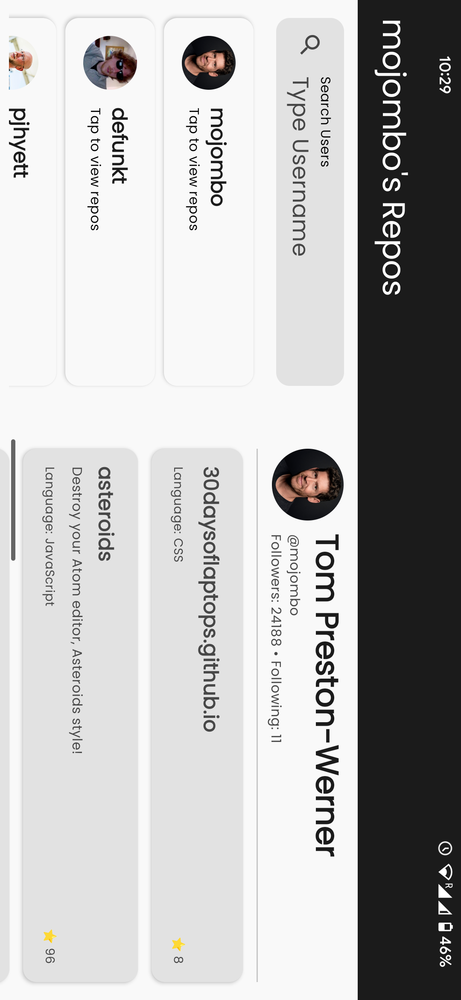
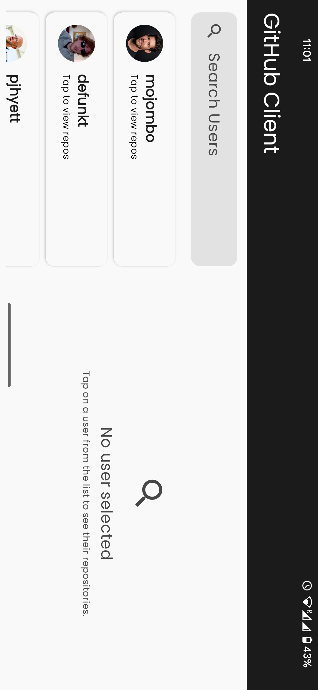
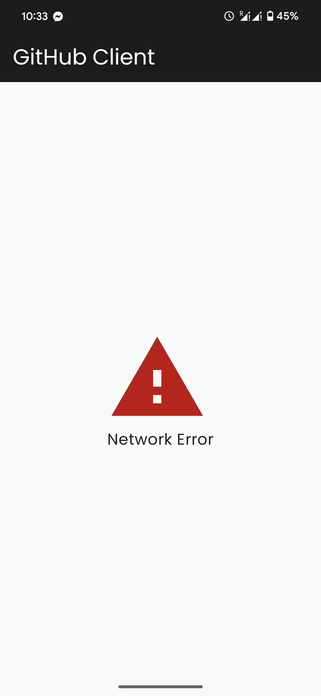
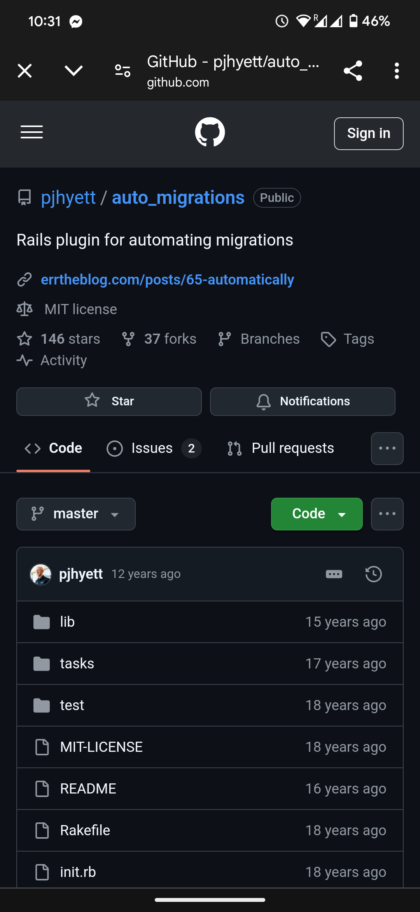

# GitHub Client App

A modern Android application built using Kotlin and Jetpack Compose that displays GitHub users and their public repositories. Designed with adaptive layouts and clean architecture principles.

---

## ✅ Core Features

The following features have been fully implemented:

- ✅ **GitHub user list** fetched from `https://developer.github.com/v3/`
- ✅ **Search functionality** to filter users by username
- ✅ **Clicking a user** navigates to a detail screen showing their public repositories
- ✅ **Repository list** includes name, description, stars, and language
- ✅ **Responsive layout** that adapts to both portrait and landscape using `ListDetailPaneScaffold`
- ✅ **Jetpack Compose** used for all UI
- ✅ **MVVM Architecture** applied across all modules
- ✅ **At least one Unit Test** and one UI Test included
- ✅ **GitHub Authentication** using Personal Access Token with header injection

---

## ✨ Additional Features Added

The following extra enhancements were implemented:

- ⚡ **Offline support** via Room database for both users and search
- 📱 **Adaptive UI** with `ListDetailPaneScaffold` for landscape and tablet-friendly layout
- 🔁 **Custom shimmer loading effect** without using external libraries
- 🧪 **Multiple test cases** covering ViewModel, UI, DAO with `mockk`, `espresso`, `coroutines-test`
- 🧩 **Clean modular structure** using separate modules for features, data, storage, theme, and common
- 🔐 **Secure token & base URL config** through `local.properties`
- 🌐 **Chrome Custom Tabs** used to open repository links externally
- 🔄 **Live search with debounce** using `StateFlow`
- 🧱 **Version Catalog** powered by `libs.versions.toml` for managing dependencies centrally

---

## 📈 Tech Stack

- **Language:** Kotlin
- **UI:** Jetpack Compose (Material3)
- **Architecture:** MVVM + Clean Modular
- **Navigation:** ListDetailPaneScaffold (adaptive)
- **DI:** Hilt
- **Database:** Room
- **Network:** Ktor + Serialization
- **Image:** Coil

---

## 🔧 Configuration

Create a file named `local.properties` in the project root, and add:

```properties
base_url=https://api.github.com
access_token=YOUR_ACCESS_TOKEN
```

> Replace `access_token` with your GitHub personal access token

---

## 🧪 Tests

### 🧬 Unit Tests
- `UsersViewModelTest` (flow, debounce, state)
- `UserDaoTest` (Room in-memory)
- `FakeMainRepositoryImplTest`

### 🖥️ UI Tests
- `UserListScreenTest` with Compose UI Test

### 🛠 Tools
- `mockk`, `espresso`, `coroutines-test`, `compose-ui-test`, `junit`

---

## 🔮 Possible Future Enhancements

The following features were considered but intentionally skipped to keep the project clean, loosely coupled, and easy to evaluate. They can be added easily due to the modular architecture:

- [ ] **Paging 3 support** for user and repo lists  
      ⤷ Currently limited to 50 users to reduce API usage and simplify implementation. Architecture supports adding Paging via RemoteMediator easily.

- [ ] **Repository details as full screen view**  
      ⤷ Current design uses master-detail layout. Full page navigation can be added for smaller screens.

- [ ] **Improved error handling & retry mechanism**  
      ⤷ Currently shows basic error message. Retry button and custom error UI can improve UX.

- [ ] **CI/CD Integration** using GitHub Actions  
      ⤷ Auto-test run and lint checks can be configured easily.

- [ ] **Dark mode toggle** and theme switcher  
      ⤷ App already uses Material3 theming — toggle can be added easily.

- [ ] **In-app repository search** within user details  
      ⤷ Useful if user has 100+ repos. Not included to stay focused on core functionality.

- [ ] **Support for tablet split-view layout**  
      ⤷ Scaffold already adaptive. Can optimize for larger breakpoints.

---

## 🏃 How to Run

```bash
./gradlew test                  # Run all unit tests
./gradlew connectedAndroidTest # Run UI tests (requires emulator/device)
```

---

## 📁 Project Structure

```
├── app/                  # Main app module (entry point)
├── features/
│   ├── main/             # User list & repository screen
│   └── auth/             # (if implemented)
├── common/               # Shared data models & constants
├── storage/              # Room DB, DataStore
├── network/              # Ktor request handler
├── theme/                # Jetpack Compose theming
```

---

## 📸 Screenshots

<div align="center">

<table>
  <tr>
    <td></td>
    <td></td>
    <td></td>
  </tr>
  <tr>
    <td></td>
    <td></td>
    <td></td>
  </tr>
  <tr>
    <td></td>
    <td></td>
    <td></td>
  </tr>
  <tr>
    <td></td>
  </tr>
</table>

</div>

> 📌 You can click each image to zoom on GitHub web view.

---

## 🎥 Demo Video

[](https://www.youtube.com/watch?v=pzxTVq5kKnE)

---

## 👤 Developer

**Md Sabbir Ahmed Khan**  
Android Developer | Kotlin & Compose Enthusiast  
🇸🇬 Singapore | 📧 rey.sabbir@gmail.com  
🔗 [GitHub](https://github.com/sabbirreyjohn)
